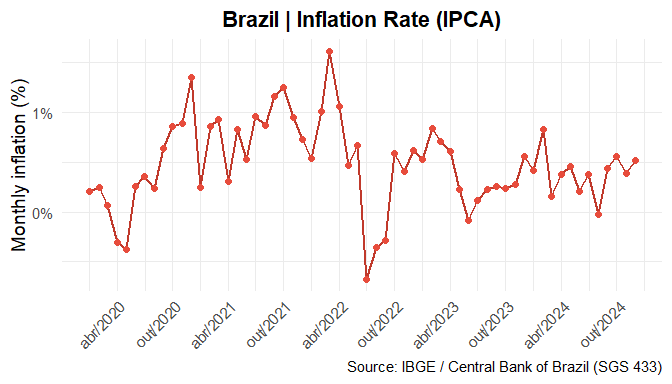
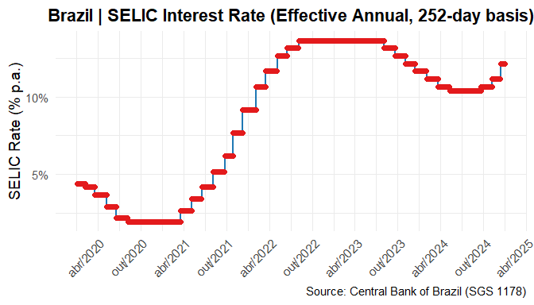
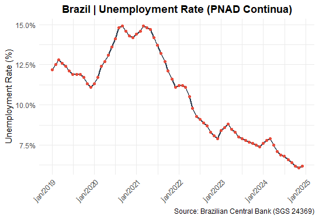
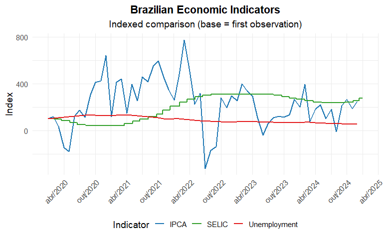

# brfinance 📊🇧🇷

[](https://cran.r-project.org/package=brfinance)
[](https://opensource.org/licenses/MIT)
[](https://github.com/efram2/brfinance/actions/workflows/R-CMD-check.yaml)
[](https://cran.r-project.org/package=brfinance)
[](https://cran.r-project.org/package=brfinance)
[](https://github.com/efram2/brfinance/stargazers)
[](https://github.com/efram2/brfinance/network)

**brfinance** is an R package that provides simplified access to Brazilian macroeconomic time series from the Central Bank of Brazil, along with practical financial calculators.

If you work with **Brazilian data**, **interest rates**, **inflation**,
or **financial math**, this package is for you.

------------------------------------------------------------------------

## Why brfinance?

With **brfinance**, you can:

- Access official Brazilian macroeconomic time series from the Central Bank of Brazil (SGS)
- Retrieve clean and standardized time series (`date` + `value`)
- Plot key indicators with one line of code
- Run financial calculations (NPV, IRR, PV, FV, PMT, rates)

No manual API handling. No data wrangling required.

------------------------------------------------------------------------

# Installation

``` r
install.packages("brfinance")

# Or development version from GitHub
install.packages("devtools")
devtools::install_github("efram2/brfinance")

library(brfinance)
```

# 🚀 Quick Start

**Inflation (IPCA)**

``` r
plot_inflation_rate(
  get_inflation_rate("2020", "2024")
)
```



**SELIC interest rate**

``` r
plot_selic_rate(
  get_selic_rate(2020, 2024)
)
```



**Unemployment rate**

``` r
plot_unemployment(
  get_unemployment("2019", "2024")
)
```



**Compare multiple indicators in one chart**

You can compare different economic indicators using: 1. raw values 2.
indexed series (base = first observation) 3. percentage change from the
first observation

- Want to analyze how different economic indicators evolve together?
- Use *plot_series_comparison()* to compare multiple time series in a
  single, clean visualization.

``` r
plot_series_comparison(
  data_list = list(
    "SELIC" = get_selic_rate(2020, 2024),
    "IPCA"  = get_inflation_rate("2020", "2024"),
    "Unemployment" = get_unemployment("2020", "2024")
  ),
  y_vars = rep("value", 3),
  date_vars = rep("date", 3),
  scale_type = "index",
  title = "Brazilian Economic Indicators",
  subtitle = "Indexed comparison (base = first observation)"
)
```



**Financial Calculators (minimalista)**

``` r
# Net Present Value
calc_npv(0.1, c(-1000, 300, 400, 500))

# Internal Rate of Return
calc_irr(c(-1000, 300, 400, 500))

# Loan payment
calc_pmt(rate = 0.02, n = 24, pv = 10000)
```

# Function Reference

## Data retrieval functions (`get_*`)

- `get_inflation_rate()` → Retrieves Brazil’s official inflation rate
  (IPCA)
- `get_selic_rate()` → Retrieves the SELIC interest rate
- `get_cdi_rate()` → Retrieves the CDI interest rate
- `get_exchange_rate()` → Retrieves official exchange rates
- `get_gdp_growth()` → Retrieves GDP growth rates
- `get_unemployment()` → Retrieves unemployment rate from PNAD Contínua

All `get_*` functions support flexible date inputs: `"YYYY"`,
`"YYYY-MM"`, or `"YYYY-MM-DD"`.

------------------------------------------------------------------------

## Plotting functions (`plot_*`)

- `plot_inflation_rate()` → Plots IPCA inflation over time
- `plot_selic_rate()` → Plots the SELIC interest rate
- `plot_cdi_rate()` → Plots the CDI interest rate
- `plot_exchange_rate()` → Plots exchange rate time series
- `plot_gdp_growth()` → Plots GDP growth over time
- `plot_unemployment()` → Plots unemployment rate time series
- `plot_series_comparison()` → Compares multiple economic indicators in
  one chart

------------------------------------------------------------------------

## Financial calculators (`calc_*`)

- `calc_pv()` → Present Value
- `calc_fv()` → Future Value
- `calc_npv()` → Net Present Value
- `calc_irr()` → Internal Rate of Return
- `calc_pmt()` → Loan payment calculation
- `calc_rate()` → Interest rate calculation
- `calc_nper()` → Number of periods
- `calc_compound_interest()` → Compound interest calculation
- `calc_continuous_interest()` → Continuous compounding
- `calc_rule72()` → Rule of 72 approximation
- `calc_rule114()` → Rule of 114 approximation

# Language Support

All main functions support bilingual output:

- language = “eng” (default): Returns English column names and labels
- language = “pt”: Returns Portuguese column names and labels

# Data sources

All data are retrieved from official Brazilian institutions:

- Central Bank of Brazil (BCB) via the SGS API

# Contribution

Suggestions, feature requests, and pull requests are welcome!
