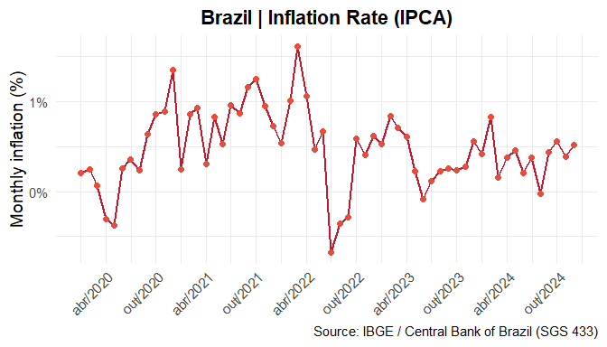
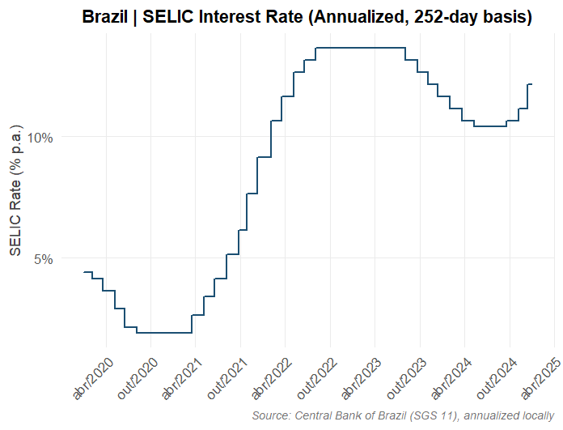
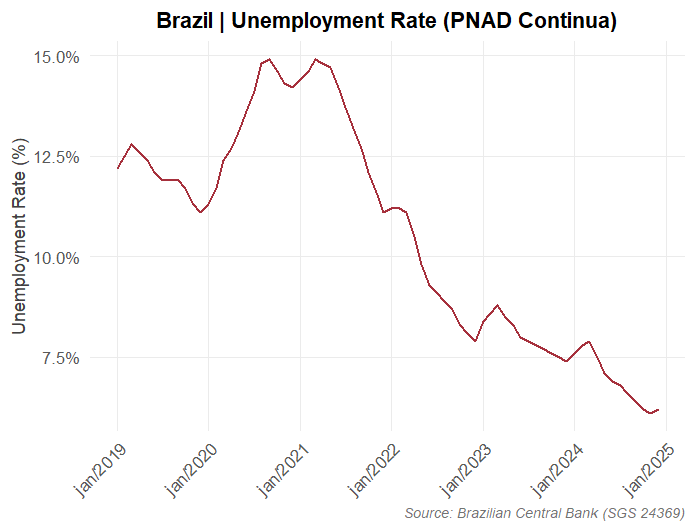
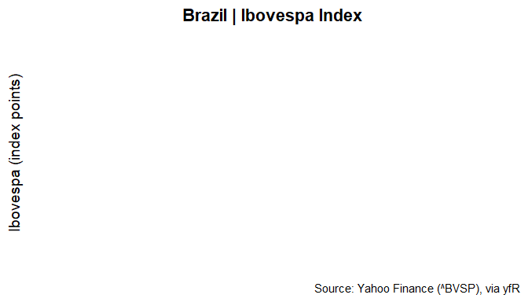
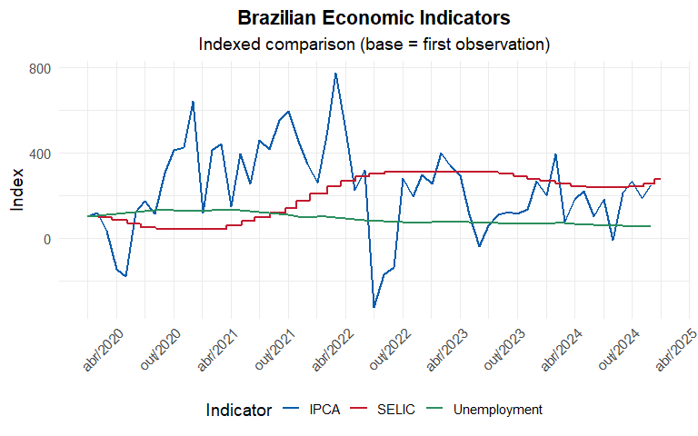
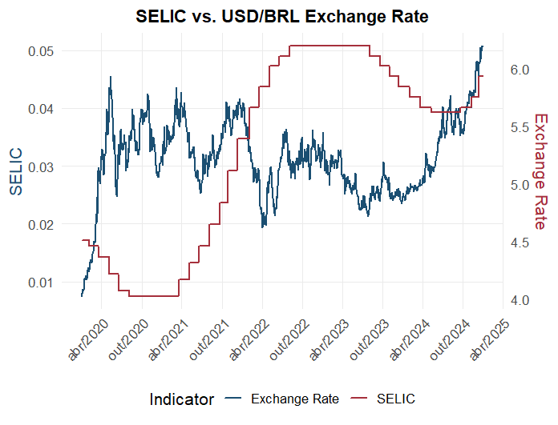

# brfinance 📊🇧🇷

[](https://cran.r-project.org/package=brfinance)
[](https://opensource.org/licenses/MIT)
[](https://github.com/efram2/brfinance/actions/workflows/R-CMD-check.yaml)
[](https://cran.r-project.org/package=brfinance)
[](https://cran.r-project.org/package=brfinance)
[](https://github.com/efram2/brfinance)
[](https://github.com/efram2/brfinance/network)

**brfinance** provides a unified, consistent R interface for accessing Brazilian macroeconomic data and performing core financial math calculations. 

Instead of writing custom API wrappers, parsing raw JSON responses, or dealing with inconsistent date formats, **brfinance** standardizes macroeconomic series into clean `data.frame` outputs with consistent `date` and `value` structure. It also includes built-in `ggplot2` visualization functions and essential corporate finance routines.

---

### Key Capabilities

- **Macroeconomic Data Access**: Query official series from the Central Bank of Brazil (BCB) and IBGE (via SGS), including interest rates (SELIC, CDI), inflation metrics (IPCA), exchange rates (USD/BRL), GDP growth, and unemployment (PNAD Contínua).
- **Equity Market Benchmark**: Download historical Ibovespa index daily data via Yahoo Finance using the same standardized interface.
- **Financial Math Calculators**: Perform calculations for NPV, IRR, PV, FV, annuities, loan payments (`PMT`), amortization schedules, interest rate conversions, and rule estimates.
- **Ready-to-Use Visualizations**: Generate publication-ready `ggplot2` charts with unified color palettes and customizable scaling (raw, indexed, percentage change, or dual-axis).
- **Production-Ready Data Engine**: Automatic 10-year query chunking for long time series, flexible date inputs (`YYYY`, `YYYY-MM`, `YYYY-MM-DD`), and bilingual metadata support (`English` and `Portuguese`).

> **Looking for individual stock analysis?** `brfinance` focuses on macroeconomic indicators and market benchmarks. For individual B3 equity data, portfolio optimization, and Markowitz analysis, see the companion package [**{brstocks}**](https://github.com/efram2/brstocks).

---

## Installation

Install the stable version from CRAN:

```r
install.packages("brfinance")
```

Or install the development version from GitHub:

```r
# install.packages("devtools")
devtools::install_github("efram2/brfinance")
```

Load the package:

```r
library(brfinance)
```

---

## Quick Start

Every data retrieval function (`get_*`) returns a standardized `data.frame` with `date` and `value` columns (plus specialized columns where appropriate).

### 1. Macroeconomic Series & Visualizations

**Inflation Rate (IPCA)**

```r
plot_inflation_rate(
  get_inflation_rate("2020", "2024")
)
```



**SELIC Interest Rate**

```r
plot_selic_rate(
  get_selic_rate("2020", "2024")
)
```



**Unemployment Rate (PNAD Contínua)**

```r
plot_unemployment(
  get_unemployment("2019", "2024")
)
```



**Ibovespa Index Benchmark**

```r
plot_ibovespa(
  get_ibovespa("2020-01-01", "2024-12-31")
)
```



---

### 2. Economic Target Analysis & Series Comparison

**IPCA vs. Inflation Target Gap**

Evaluate whether inflation is operating within the National Monetary Council (CMN) target parameters:

```r
ipca_gap <- get_ipca_from_target("2015", "2024")
head(ipca_gap)
```

```
        date ipca_12m target  gap
1 2015-01-01     7.14    4.5 2.64
2 2015-02-01     7.70    4.5 3.20
3 2015-03-01     8.13    4.5 3.63
4 2015-04-01     8.17    4.5 3.67
5 2015-05-01     8.47    4.5 3.97
6 2015-06-01     8.89    4.5 4.39
```

**Multi-Series Comparison (Indexed)**

Compare indicators across different scales by indexing from the first observation (Base = 100):

```r
plot_series_comparison(
  data_list = list(
    "SELIC" = get_selic_rate("2020", "2024"),
    "IPCA"  = get_inflation_rate("2020", "2024"),
    "Unemployment" = get_unemployment("2020", "2024")
  ),
  y_vars = rep("value", 3),
  date_vars = rep("date", 3),
  scale_type = "index",
  title = "Brazilian Economic Indicators",
  subtitle = "Indexed comparison (base = first observation)"
)
```



**Dual-Axis Comparison**

Compare two indicators with different original units (e.g., % rate vs. currency rate) without loss of scale resolution:

```r
plot_series_comparison(
  data_list = list(
    "SELIC" = get_selic_rate("2020", "2024"),
    "Exchange Rate" = get_exchange_rate("2020-01-01", "2024-12-31")
  ),
  y_vars = c("value", "value"),
  date_vars = c("date", "date"),
  dual_axis = TRUE,
  title = "SELIC vs. USD/BRL Exchange Rate"
)
```



---

### 3. Financial Mathematics & Cash Flow Analysis

```r
# Net Present Value (NPV)
calc_npv(rate = 0.1, cashflows = c(-1000, 300, 400, 500))
#> [1] -21.03681

# Internal Rate of Return (IRR)
calc_irr(cashflows = c(-1000, 300, 400, 500))
#> [1] 0.08896339

# Periodic Loan Payment (PMT)
calc_pmt(pv = 10000, rate = 0.02, n = 24)
#> [1] 528.711

# Amortization Schedule (First 3 periods)
head(calc_amortization_schedule(pv = 10000, rate = 0.01, n = 12), 3)
#>   Period Beginning_Balance  Payment Interest Principal Ending_Balance
#> 1      1          10000.00 888.4879 100.0000  788.4879       9211.512
#> 2      2           9211.51 888.4879  92.1151  796.3728       8415.139
#> 3      3           8415.14 888.4879  84.1514  804.3365       7610.803
```

---

## Function Reference

### Data Retrieval (`get_*`)

| Function | Description | Source |
| :--- | :--- | :--- |
| `get_inflation_rate()` | Brazil's official monthly inflation rate (IPCA) | BCB / SGS |
| `get_ipca_from_target()` | 12-month accumulated IPCA vs. official CMN target and gap | BCB / SGS |
| `get_selic_rate()` | Daily SELIC interest rate, annualized (base 252) | BCB / SGS |
| `get_cdi_rate()` | Daily CDI interbank rate, annualized | BCB / SGS |
| `get_exchange_rate()` | Daily USD/BRL exchange rate | BCB / SGS |
| `get_gdp_growth()` | Quarterly and annual GDP growth rates | BCB / SGS |
| `get_unemployment()` | Unemployment rate (PNAD Contínua) | IBGE via BCB SGS |
| `get_ibovespa()` | Ibovespa market index closing levels | Yahoo Finance |
| `browse_series()` / `get_series_info()` | Catalog exploration tools for additional Central Bank series | BCB / SGS |

**Query Handling & Features:**
- **Date Flexibility**: Accepts `"YYYY"`, `"YYYY-MM"`, or `"YYYY-MM-DD"`.
- **Automatic Chunking**: Queries spanning more than 10 years are automatically partitioned into sub-requests to respect Central Bank API limitations and joined seamlessly.

---

### Visualization (`plot_*`)

| Function | Description | Visual Palette |
| :--- | :--- | :--- |
| `plot_inflation_rate()` | Time series plot of IPCA inflation | Market Red (Cost/Risk) |
| `plot_selic_rate()` | Time series plot of SELIC interest rate | Market Blue (Benchmark) |
| `plot_cdi_rate()` | Time series plot of CDI interest rate | Market Blue (Benchmark) |
| `plot_exchange_rate()` | Time series plot of USD/BRL exchange rate | Market Blue (Benchmark) |
| `plot_unemployment()` | Time series plot of PNAD Contínua unemployment | Market Red (Cost/Risk) |
| `plot_ibovespa()` | Time series plot of Ibovespa index level | Market Blue (Benchmark) |
| `plot_series_comparison()` | Multi-indicator comparison chart (raw, indexed, % change, or dual-axis) | Multi-color palette |

---

### Financial Calculators (`calc_*` & Rules)

- **Present & Future Value**: `calc_present_value()`, `calc_future_value()`, `calc_compound_interest()`, `calc_future_value_ext()`
- **Annuities & Payments**: `calc_pv_annuity()`, `calc_fv_annuity()`, `calc_pmt()`
- **Rate & Term Solving**: `calc_rate()`, `calc_nper()`, `calc_simple_interest()`, `calc_effective_rate()`, `calc_nominal_rate()`
- **Investment Valuation**: `calc_npv()`, `calc_irr()`, `calc_amortization_schedule()`
- **Continuous Compounding**: `calc_continuous_compounding()`, `calc_pv_continuous()`
- **Quick Estimation Rules**: `rule_of_72()`, `rule_of_114()`

---

## Technical Specifications

### Data Sources & Architecture

Data integrated into `brfinance` comes from the following providers:

1. **Central Bank of Brazil (BCB / SGS)**: Official macroeconomic indicators including interest rates (SELIC, CDI), exchange rates (USD/BRL), inflation target parameters, and GDP growth.
2. **IBGE (via BCB SGS)**: PNAD Contínua unemployment data, retrieved through the Central Bank's System for Time Series Management (SGS).
3. **Yahoo Finance**: Historical daily closing levels for the Ibovespa index (`get_ibovespa()`).

### Language Support

All `get_*()` functions include a `language` parameter:

- `language = "eng"` (*default*): Returns English variable labels.
- `language = "pt"`: Returns Portuguese variable labels.

> **Pipeline Consistency**: Core data frame column names (`date`, `value`, etc.) remain identical regardless of language selection. Changing `language` alters only the descriptive variable labels (accessible via `labelled::var_label()`), ensuring existing data transformation pipelines do not break.

---

## Related Packages

- [**{brstocks}**](https://github.com/efram2/brstocks): Companion package by the same author, designed for B3 individual stock analysis, portfolio management, and interactive Markowitz efficient-frontier modeling.

---

## Contributing

Contributions, issue reports, and feature requests are welcome! Feel free to open an issue or pull request on [GitHub](https://github.com/efram2/brfinance).
